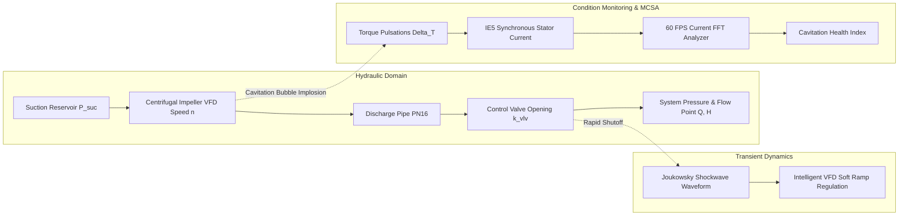

# Intelligent Pump Hydrodynamics & Cavitation Diagnostic Digital Twin

An interactive in-browser digital twin simulating centrifugal pump fluid dynamics, Affinity Laws, non-intrusive Motor Current Signature Analysis (MCSA) cavitation diagnostics, and Joukowsky water hammer mitigation, modeling commercial booster systems (such as the Grundfos CRE and MAGNA3 series).

🔗 **Live In-Browser Simulator:** [https://elomarjc.github.io/pump-hydrodynamics-digital-twin/](https://elomarjc.github.io/pump-hydrodynamics-digital-twin/)

---

## 1. System Architecture & Fluid Dynamics Overview

Centrifugal pumps handle variable demand across municipal water supply and heating networks. When suction pressure drops below the fluid's vapor pressure ($NPSH_a < NPSH_r$), micro-vapor bubbles form and collapse violently against impeller vanes with localized pressures exceeding $1\text{ GPa}$, causing destructive erosion and acoustic screeching.

This digital twin models the complete electromechanical and hydraulic loop:



---

## 2. Mathematical Foundations

### 2.1 Centrifugal Pump Hydrodynamics & Affinity Laws

The pump head curve $H_{\text{pump}}$ scales dynamically with rotational speed $n$ according to hydraulic Affinity Laws:

$$\frac{Q_1}{Q_2} = \frac{n_1}{n_2}, \quad \frac{H_1}{H_2} = \left(\frac{n_1}{n_2}\right)^2, \quad \frac{P_1}{P_2} = \left(\frac{n_1}{n_2}\right)^3$$

The instantaneous head curve is modeled as:

$$H_{\text{pump}}(Q, n) = H_0 \left(\frac{n}{n_0}\right)^2 - k_p Q^2$$

where $H_0 = 52\text{ m}$ is the shutoff head and $k_p = 0.045$ is the internal hydrodynamic loss coefficient.

The system resistance curve combines static geodetic elevation lift $H_{\text{static}}$ and friction head loss through pipe and valves:

$$H_{\text{sys}}(Q) = H_{\text{static}} + k_{\text{valve}} Q^2$$

The operating duty point $(Q^*, H^*)$ is the exact physical intersection where $H_{\text{pump}}(Q^*) = H_{\text{sys}}(Q^*)$:

$$Q^* = \sqrt{\frac{H_0 \left(\frac{n}{n_0}\right)^2 - H_{\text{static}}}{k_p + k_{\text{valve}}}}$$

Hydraulic power output:

$$P_{\text{hyd}} = \frac{\rho g Q^* H^*}{3600} \quad [\text{Watts}]$$

---

### 2.2 Net Positive Suction Head (NPSH) & Cavitation Inception

Cavitation begins when local static pressure at the impeller inlet drops below the fluid vapor pressure $P_v$:

$$NPSH_a = \frac{P_{\text{suction}} - P_v}{\rho g} + \frac{v_s^2}{2g}$$

where $P_v = 2340\text{ Pa}$ at $20^\circ\text{C}$, $\rho = 1000\text{ kg/m}^3$, and $g = 9.81\text{ m/s}^2$.

Required NPSH ($NPSH_r$) grows quadratically with flow rate:

$$NPSH_r(Q) = NPSH_0 \left(\frac{n}{n_0}\right)^2 + k_{\text{npsh}} Q^2$$

The cavitation boundary criterion:

$$\sigma_{\text{cav}} = \begin{cases} \text{Safe (Normal Flow)}, & NPSH_a \ge NPSH_r \\ \text{Cavitation Inception}, & NPSH_a < NPSH_r \end{cases}$$

---

### 2.3 Motor Current Signature Analysis (MCSA)

Rather than installing costly external accelerometers or hydrophones, cavitation is detected non-intrusively via the motor's electrical phase current.

Torque ripples induced by collapsing micro-cavities modulate the motor's magnetic air-gap flux, producing characteristic sideband harmonics around the fundamental electrical supply frequency $f_e$:

$$f_{\text{sb}} = f_e \pm k \cdot f_r$$

where $f_r = n / 60$ is the mechanical shaft frequency and $k$ is the harmonic order (including blade pass frequency $k = Z_{\text{vanes}} = 5$). The FFT analyzer measures the sideband-to-carrier ratio ($SCR$ in dB) to compute the Cavitation Health Index ($CHI$):

$$CHI = \min\left(100\%, \frac{NPSH_r - NPSH_a}{NPSH_r} \times 100\%\right)$$

---

### 2.4 Joukowsky Hydraulic Shockwave (Water Hammer)

Rapid downstream valve closure generates an acoustic pressure wave traveling upstream toward the pump:

$$\Delta P = \rho \cdot a \cdot \Delta v$$

where:
* $a = 1200\text{ m/s}$ is the acoustic sonic wave speed in water-filled steel piping.
* $\Delta v = \frac{Q^* / 3600}{A_{\text{pipe}}}$ is the sudden fluid velocity drop ($A_{\text{pipe}} = \pi D^2 / 4$).

For an unprotected closure ($t_{\text{close}} \le 2L/a \approx 0.25\text{ s}$), pressure surges exceed $20\text{ bar}$, rupturing $PN16$ rated piping. Grundfos-style intelligent soft-ramp deceleration limits $\Delta P$ to safe thresholds ($< 1.5\text{ bar}$).

---

## 3. Interactive Web Features

* **Dynamic H-Q Curve Scope:** 60 FPS Canvas showing pump head curve, system resistance curve, and dynamic operating point intersection.
* **Non-Intrusive MCSA Spectrum:** Real-time 64-bin FFT spectrum visualizing fundamental stator frequency and emergence of cavitation sideband harmonics.
* **Hydraulic Flow Schematic:** Animated cross-section of suction reservoir, spinning centrifugal impeller, and visible micro-bubble implosions.
* **Surge & Water Hammer Scope:** Transient pressure oscilloscope comparing sudden emergency trips against intelligent VFD soft-ramp closures against the PN16 pipeline class.

---

## 4. Verification & Unit Tests

Unit tests verify Affinity Laws scaling, cavitation boundary detection, and Joukowsky shockwave equations:

```bash
node --test test/test_pump_twin.mjs
```

Results:
* `PumpHydraulics`: Affinity law speed scaling and $(Q, H)$ duty point verified.
* `PumpHydraulics`: Inception of cavitation when $NPSH_a < NPSH_r$ verified.
* `MCSAAnalyzer`: Fundamental peak and cavitation sideband detection verified.
* `WaterHammerEngine`: Unprotected surge exceeding PN16 and VFD soft-ramp mitigation verified.

---

## 5. Author & Academic Context

* **Author:** Jacob El-Omar
* **Institution:** Aalborg University (AAU)
* **Academic Credentials:** Bachelor's Project in Electronic Engineering (Control & Automation, Sensor Systems, Signal Processing)
